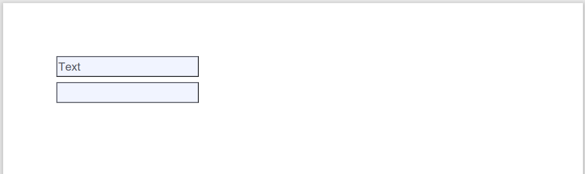
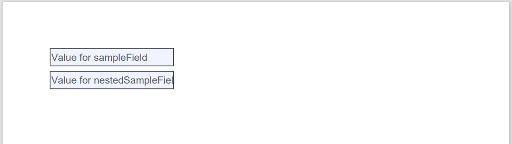

# Overview

Some sample code and configuration to see how to create your own functions in [Pega Launchpad](https://launchpad.io/). Use as examples or starter code for your own functions as needed.

# Table of Contents
<!-- TOC -->
* [Overview](#overview)
* [Table of Contents](#table-of-contents)
* [References](#references)
* [Obtaining the JAR to upload into a Function rule](#obtaining-the-jar-to-upload-into-a-function-rule)
* [Base64 examples](#base64-examples)
  * [Decode a base64 string](#decode-a-base64-string)
  * [encode a string with base64](#encode-a-string-with-base64)
* [Parser examples](#parser-examples)
  * [Text To List: Parses a delimited string into a List of cases](#text-to-list-parses-a-delimited-string-into-a-list-of-cases)
  * [CSV To List: Parses a CSV file content into a List of cases](#csv-to-list-parses-a-csv-file-content-into-a-list-of-cases)
* [PDF examples](#pdf-examples)
  * [Set fields in form and generate filled-in PDF](#set-fields-in-form-and-generate-filled-in-pdf)
* [Text examples](#text-examples)
  * [Regular Expression: evaluate text against a regex](#regular-expression-evaluate-text-against-a-regex)
  * [Format a java string with substitution values](#format-a-java-string-with-substitution-values)
* [JSON examples](#json-examples)
  * [deserialize a json string with a single top-level object](#deserialize-a-json-string-with-a-single-top-level-object)
  * [JSON: deserialize a json string with a top-level array of objects](#json-deserialize-a-json-string-with-a-top-level-array-of-objects)
<!-- TOC -->

# References

- Pega Launchpad [overview](https://launchpad.io)
- Creating [Function](https://docs.pega.com/bundle/launchpad/page/platform/launchpad/creating-custom-functions.html) rules
- Dependencies: [Apache Commons CSV](https://commons.apache.org/proper/commons-csv/), [Google Gson](https://github.com/google/gson), [Apache PDFBox](https://pdfbox.apache.org/)

# Obtaining the JAR to upload into a Function rule

You can download the latest JAR release from the [project release page](https://github.com/miratim/PegaLPSTTools/releases), or you can generate the necessary JAR file (including dependencies) for uploading into a Pega Launchpad Function rule, run this command:

```gradlew build```

This will create/update the ```lpst-*-SNAPSHOT.jar``` file under the ```./build/libs``` folder in your workspace.

Note the JAR embeds all the dependent JARs, creating a fairly large file. This is necessary so the Function can be invoked as a lambda.

# Base64 examples

## Decode a base64 string

This method takes a base64 string and decodes it.

### Java code info
- **Class**: [com.pega.lpst.Base64](https://github.com/miratim/PegaLPSTTools/blob/master/src/main/java/com/pega/lpst/Base64.java)
- **Method**: decode

### Function rule configuration

- Function handler: com.pega.lpst.Base64::decode
- Input parameters:
  - **text (Text)**
- Output parameters:
  - **Type**: Text

## encode a string with base64

This method takes a plain string and encodes it in base64.

### Java code info
- Class:  [com.pega.lpst.Base64](https://github.com/miratim/PegaLPSTTools/blob/master/src/main/java/com/pega/lpst/Base64.java)
- Method: encode

### Function rule configuration
- Function handler: com.pega.lpst.Base64::encode
- Input parameters:
  - **text (Text)**
- Output parameters:
  - **Type**: Text

# Parser examples

## Text To List: Parses a delimited string into a List of cases

This method takes a delimited string, and returns its tokens in a List of Map<String,String> objects. You can use a JSON transform to map those tokens back into your application data as required.

### Java code info
- **Class**:  [com.pega.lpst.Parser](https://github.com/miratim/PegaLPSTTools/blob/master/src/main/java/com/pega/lpst/Parser.java)
- **Method**: fromDelimitedText

### Function rule configuration
- Function handler: com.pega.lpst.Parser::fromDelimitedText
- Input parameters:
  - **text (Text)**: the delimited string to parse
  - **delim (Text)**: optional - the delimiter that was used (default is ",")
- Output parameters:
  - **Type**: *[choose one of your application's case types, doesn't matter which one]*
  - **Cardinality**: Multiple
  - Note: JSON Transform rule will be required

### JSON Transform rule configuration

1. Create JSON Transform rule with:
- **Name**: the same name as your function (not required, just easier for author)
- **Purpose**: Deserialize (JSON to Pega Object)
- **Library**: Same as the case type chosen for the Function rule's output parameter **Type**
- **Top level structure**: Multiple record
2. Add source JSON data:
- **System name**: any identifier you want
- **JSON sample**: ```[{"token":"foo"},{"token":"bar"}]```
5. Map your data:
- **Source field**: token(STRING)
- **Target field**: Your application field

## CSV To List: Parses a CSV file content into a List of cases

This method takes the content of a CSV file (headers required), and returns a list of Map<?,?> objects, where each object has member fields where the field name is the column name from your CSV header, and the value is the value for that column for that record. You must use a JSON Transform to map this list of objects back into your application object structure.

### Java code info
- **Class**: [com.pega.lpst.Parser](https://github.com/miratim/PegaLPSTTools/blob/master/src/main/java/com/pega/lpst/Parser.java)
- **Method**: fromCsv

### Function rule configuration
- Function handler: com.pega.lpst.Parser::fromCsv
- Input parameters:
  - **csv (Text)**: csv file content to parse
- Output parameters:
  - **Type**: *[choose one of your application's case types, doesn't matter which one]*
  - **Cardinality**: Multiple
  - Note: JSON Transform rule will be required

### JSON Transform rule configuration

1. Create JSON Transform rule with:
- **Name**: the same name as your function (not required, just easier for author)
- **Purpose**: Deserialize (JSON to Pega Object)
- **Library**: Same as the case type chosen for the Function rule's output parameter **Type**
- **Top level structure**: Multiple record
2. Add source JSON data:
- **System name**: any identifier you want
- **JSON sample**: a json array with one element: a json object representing one record in your csv, with name:value pairs corresponding to the column names and record values. Example: ```[{"name":"tim","city":"Waltham","state":"MA"}]```
3. Map your data. Using the above name/city/state structure as an example:
- **Source field**: name(STRING)
- **Target field**: .CustomerName
- **Source field**: city(STRING)
- **Target field**: .CustomerCity
- **Source field**: state(STRING)
- **Target field**: .CustomerState

# PDF examples

## Set fields in form and generate filled-in PDF

This method takes a base64-encoded PDF form, and a json string containing field->value mappings, and returns a base64-encoded PDF with those fields filled in as specified.

For the below example, a [sample PDF](https://github.com/miratim/PegaLPSTTools/blob/master/src/test/resources/com/pega/lpst/FillFormField.pdf) with two text fields is used as the input:


The output is base64 encoded, and can be passed to the platform attachment function ```CreateAdHocFileAttachment``` to create a file and attach it to the current case:


### Java code info
- Class:  [com.pega.lpst.PDF](https://github.com/miratim/PegaLPSTTools/blob/master/src/main/java/com/pega/lpst/PDF.java)
- Method: setFields

### Function rule configuration
- Function handler: com.pega.lpst.PDF::setFields
- Input parameters:
  - **inputForm (Text)**: Base64-encoded PDF document that has form elements.
  - **fieldJson (Text)**: Single json object that specifies the fields and values to set. Example for the sample PDF: ```{"fieldsContainer.nestedSampleField":"Value for nestedSampleField","sampleField":"Value for sampleField"}```
- Output parameters:
  - **Type**: Text: The base64-encoded PDF with the specified fields set to the specified value

# Text examples

## Regular Expression: evaluate text against a regex

This method takes a regex string, and a text string, and sees if the pattern matches the text

### Java code info
- **Class**: [com.pega.lpst.Text](https://github.com/miratim/PegaLPSTTools/blob/master/src/main/java/com/pega/lpst/Text.java)
- **Method**: regex

### Function rule configuration

- Function handler: com.pega.lpst.Text::regex
- Input parameters:
  - **regex (Text)**: A regular expression [pattern](https://docs.oracle.com/en/java/javase/22/docs/api/java.base/java/util/regex/Pattern.html)
  - **text (Text)**: The text to evaluate
  - **caseInsensitive (Text)**: Optional - true or false
- Output parameters:
  - **Type**: Boolean: true if the text matches the regular expression pattern, false otherwise

## Format a java string with substitution values

This method is a wrapper for the java String.format() method, to substitute values into a string and return the formatted string.

### Java code info
- Class:  [com.pega.lpst.Text](https://github.com/miratim/PegaLPSTTools/blob/master/src/main/java/com/pega/lpst/Text.java)
- Method: setFields

### Function rule configuration
- Function handler: com.pega.lpst.Text::format
- Input parameters:
  - **format (Text)**: a valid java String [format](https://docs.oracle.com/en/java/javase/21/docs/api/java.base/java/util/Formatter.html#syntax) like ```Please contact %s for details, or %s for other questions```
  - **values (Text)**: a comma-delimited string of values to use, like ```Tim,Gabe```
- Output parameters:
  - **Type**: Text: The formatted String. For the example inputs above, the result would be ```Please contact Tim for details, or Gabe for other questions```

# JSON examples

## deserialize a json string with a single top-level object

This method takes a json string, containing a single top-level object, and returns a TreeMap. The returned map can be processed by a JSON Transform to map values back into your application data structure.

### Java code info
- **Class**: [com.pega.lpst.Parser](https://github.com/miratim/PegaLPSTTools/blob/master/src/main/java/com/pega/lpst/Parser.java)
- **Method**: fromJsonObject

### Function rule configuration

- Function handler: com.pega.lpst.Parser::fromJsonObject
- Input parameters:
  - **json (Text)**: The json string to evaluate
- Output parameters:
  - **Type**: *[choose the application case type you want to map data into]*
  - **Cardinality**: Single
  - Note: JSON Transform rule will be required

### JSON Transform rule configuration

1. Create JSON Transform rule with:
- **Name**: the same name as your function (not required, just easier for author)
- **Purpose**: Deserialize (JSON to Pega Object)
- **Library**: Same as the case type chosen for the Function rule's output parameter **Type**
- **Top level structure**: Single record
2. Add source JSON data:
- **System name**: any identifier you want
- **JSON sample**: ```(example json structure from your use case)```
3. Map your data from the JSON structure into your application object structure

## deserialize a json string with a top-level array of objects

This method takes a json string, containing a top-level array of objects, and returns a List of TreeMap objects. The returned maps can be processed by a JSON Transform to map values back into your application data structure.

### Java code info
- **Class**: [com.pega.lpst.Parser](https://github.com/miratim/PegaLPSTTools/blob/master/src/main/java/com/pega/lpst/Parser.java)
- **Method**: fromJsonArray

### Function rule configuration

- Function handler: com.pega.lpst.Parser::fromJsonArray
- Input parameters:
  - **json (Text)**: The json string to evaluate
- Output parameters:
  - **Type**: *[choose the application case type you want to map data into]*
  - **Cardinality**: Multiple
  - Note: JSON Transform rule will be required

### JSON Transform rule configuration

1. Create JSON Transform rule with:
- **Name**: the same name as your function (not required, just easier for author)
- **Purpose**: Deserialize (JSON to Pega Object)
- **Library**: Same as the case type chosen for the Function rule's output parameter **Type**
- **Top level structure**: Multiple records
2. Add source JSON data:
- **System name**: any identifier you want
- **JSON sample**: ```(example json structure from your use case)```
3. Map your data from the JSON structure into a multi-object field in your application object structure  
