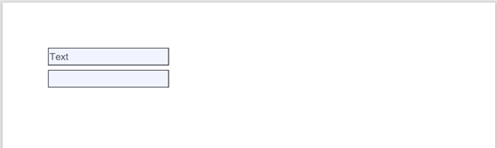
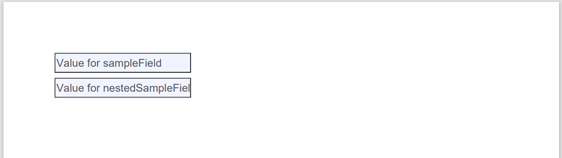

# PDF functions

<!-- TOC -->
* [PDF functions](#pdf-functions)
  * [Set fields in PDF file (base64) and generate filled-in PDF](#set-fields-in-pdf-file-base64-and-generate-filled-in-pdf)
  * [Set fields in PDF file (URL) and generate filled-in PDF](#set-fields-in-pdf-file-url-and-generate-filled-in-pdf)
<!-- TOC -->


## Set fields in PDF file (base64) and generate filled-in PDF

This method takes a base64-encoded PDF form, and a json string containing field->value mappings, and returns a base64-encoded PDF with those fields filled in as specified.

For the below example, a [sample PDF](https://github.com/miratim/PegaLPSTTools/blob/master/src/test/resources/com/pega/lpst/FillFormField.pdf) with two text fields is used as the input:



The output is base64 encoded, and can be passed to the platform attachment function ```CreateAdHocFileAttachment``` to create a file and attach it to the current case:



To discover the actual fields names of a PDF file, there are a couple of options:
1. Use the [pdftk](https://www.pdflabs.com/tools/pdftk-the-pdf-toolkit/) command line tool
2. Use the [pdfbox](https://pdfbox.apache.org/) java library to iterate through all fields in a form and set the value of that field to the qualified name of the field.

### Java code info
- **Class**: [com.pega.launchpad.pdf.PDF](src/main/java/com/pega/launchpad/pdf/PDF.java)
- **Method**: setFieldsWithBase64

### Function rule configuration
- Function handler: com.pega.launchpad.pdf.PDF::setFieldsWithBase64
- Input parameters:
  - **inputForm (Text)**: Base64-encoded PDF document that has form elements.
  - **fieldJson (Text)**: Single json object that specifies the fields and values to set. Example for the sample PDF: ```{"fieldsContainer.nestedSampleField":"Value for nestedSampleField","sampleField":"Value for sampleField"}```
- Output parameters:
  - **Type**: Text: The base64-encoded PDF with the specified fields set to the specified value

## Set fields in PDF file (URL) and generate filled-in PDF

This method takes the URL for a PDF file, and a json string containing field->value mappings, and returns a base64-encoded PDF with those fields filled in as specified.

For the below example, a [sample PDF from a URL](https://svn.apache.org/viewvc/pdfbox/trunk/examples/src/main/resources/org/apache/pdfbox/examples/interactive/form/FillFormField.pdf?view=co) with two text fields is used as the input:


The output is base64 encoded, and can be passed to the platform attachment function ```CreateAdHocFileAttachment``` to create a file and attach it to the current case:


To discover the actual fields names of a PDF file, there are a couple of options:
1. Use the [pdftk](https://www.pdflabs.com/tools/pdftk-the-pdf-toolkit/) command line tool
2. Use the [pdfbox](https://pdfbox.apache.org/) java library to iterate through all fields in a form and set the value of that field to the qualified name of the field.

### Java code info
- **Class**: [com.pega.launchpad.pdf.PDF](src/main/java/com/pega/launchpad/pdf/PDF.java)
- **Method**: setFieldsWithURL

### Function rule configuration
- Function handler: com.pega.launchpad.pdf.PDF::setFieldsWithURL
- Input parameters:
  - **inputURL (Text)**: A valid URL that points to a PDF document with form elements.
  - **fieldJson (Text)**: Single json object that specifies the fields and values to set. Example for the sample PDF: ```{"fieldsContainer.nestedSampleField":"Value for nestedSampleField","sampleField":"Value for sampleField"}```
- Output parameters:
  - **Type**: Text: The base64-encoded PDF with the specified fields set to the specified value
